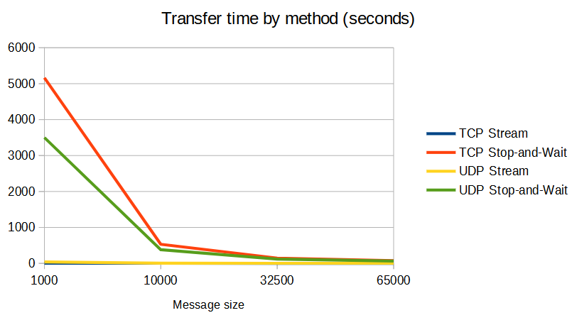
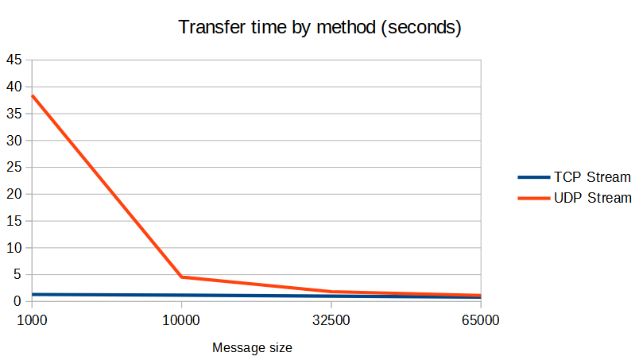
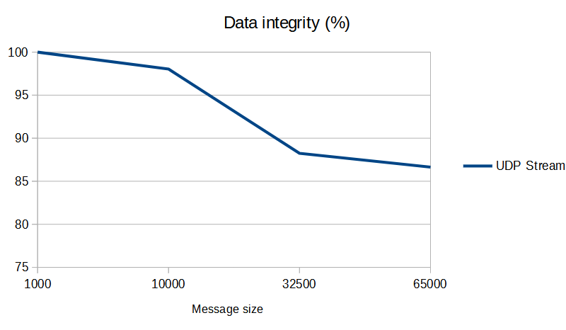

# Homework 1 Report

## Summary

- Client: sends 500MB of data to the server
- Server: reads the data sent by the client

The message size, along with the protocol, are all customizable.

## Messsage size

The message size denotes how many bytes to write via a `send` call at a time.

## Protocols

Both TCP and UDP are supported by the client and the server.

## Transmission mechanisms

- Stream: the client sends the data continuously
- Stop-and-wait: the client send a message, waits for ACK, and sends the next message. If the server doesn't acknowledge in 1 second, the client sends the message again

## Usage

Server

```sh
./server <tcp/udp> <message_size> <s/w>
```

where:

- **s**: stream
- **w**: stop-and-wait

Client

```sh
./client <tcp/udp> <message_size> <s/w> <host> <port>
```

where:

- **s**: stream
- **w**: stop-and-wait

## Experiments

The performance tests were conducted on separate VPS instances hosted on VULTR as follows:

- Client: hosted in Amsterdam, Netherlands
- Server: hosted in Frankfurt, Germany

Both machines have similar specifications (1vCPU, 2GB RAM, Debian 11 x64). The source files were compiled with GCC using `-O3 -Wall`. The OS UDP buffer size was the default value (200KB).

The following message sizes were tested:

- 1000
- 10000
- 32500
- 65000

Each combination of protocol-mechanism was tested:

- TCP stream
- TCP stop-and-wait
- UDP stream
- UDP stop-and-wait

For UDP stream, the integrity rate was also measured. This shows how many bytes of the original data have been received, and how many have been lost.

### Results

#### Transfer time - all

The chart below shows the transfer time for all methods.

<p align="center">
  
</p>

#### Transfer time - stream

The chart below shows the transfer time for the Stream method.

<p align="center">
  
</p>

#### UDP data integrity

The data integrity for UDP was also measured. Data integrity refers to the percentage of data that was transferred successfully and wasn't lost. This only makes sense for the stream method, because Stop-and-Wait makes sure that all messages arrive. The chart below shows the observed results.

<p align="center">
  
</p>

### Interpretation

The data integrity decreases as the message size increases when using UDP Stream. This is most likely due to the fact that the client
sends large amounts of data very quickly, and the server can't process them fast enough.

In general, data transfer is faster when using a large message size.

The UDP Stream method is slower than TCP Stream, which wasn't expected. Upon further research, this is most likely due to the fact that
the OS buffer size for UDP (200KB) wasn't large enough. However, the UDP Stop-and-Wait method is faster than TCP Stop-and-Wait. For large messages, the difference between the two protocols is small when using the Stream mechanism.

Considering the given configuration, TCP Stream is the best method for reliable data transfer. TCP Stop-and-Wait is redundant because TCP by design is reliable, and such a mechanism only adds overhead with no benefits. UDP Stop-and-Wait works, but is way slower than TCP Stream in the given configuration, and is therefore a worse candidate.